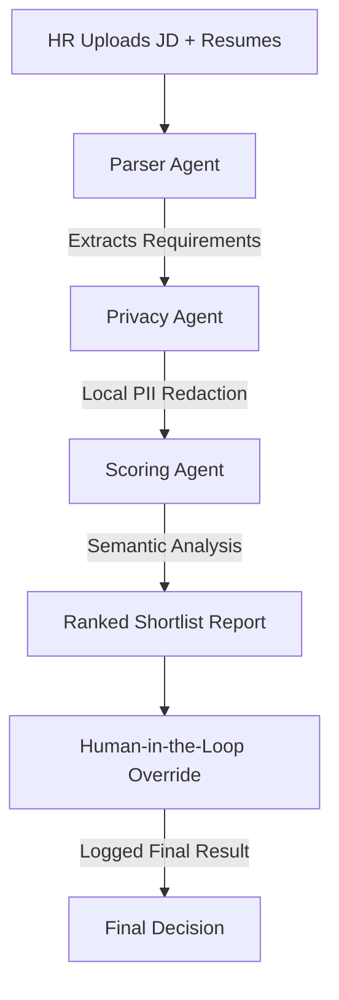

# HireTrace AI

**AI-Powered Semantic Shortlisting & Bias-Free Ranking Agent**

**HireTrace AI** is a specialized recruitment auditing platform designed to eliminate unconscious bias and manual inefficiency in technical hiring. Developed during the **AI Enablement Internship**, this tool leverages a multi-agent architecture to perform deep technical gap analysis while strictly adhering to enterprise-grade privacy standards.


**Core Features:**

* **The Privacy Shield**: Implements **Microsoft Presidio** to automatically redact PII (Names, Emails, Phone Numbers) locally before any data is transmitted to the LLM, ensuring 100% candidate anonymity during the audit phase.
* **Semantic Competency Mapping**: Moves beyond traditional keyword matching by evaluating high-level engineering logic, project complexity (e.g., RAG pipelines, Agentic AI), and transferable technical skills.
* **Deterministic Ranking Engine**: Configured with a strictly locked **Temperature (0.0)** to provide consistent, repeatable, and defensible scoring across multiple analysis runs.
* **Modest & Precise Scoring**: Utilizes a custom-calibrated scoring rubric that weights Skills Match (30%), Experience Relevance (25%), and Project Complexity (20%) to distinguish "High-Tier" engineers from "Average" matches.
* **High-Tech UI**: A professional dark-themed **Streamlit** interface featuring "shimmering" animated titles and action-oriented "glitter" buttons for a modern production-ready feel.


**Technical Stack:**

* **Frontend**: Streamlit
* **Intelligence**: Llama 3.1-8B-Instant (via Groq Cloud)
* **Security/PII**: Microsoft Presidio (Analyzer & Anonymizer)
* **Parsing**: PyPDF2 / PDFMiner
* **Database Management**: Integration logic for Vector Stores (Neon/PostgreSQL)


**Evaluation Logic:**

* The system evaluates candidates against high-level standards (e.g., Schneider Electric Business Analytics requirements), specifically looking for proficiency in Tableau, Excel modeling, and Python-driven data cleaning, while rewarding candidates who demonstrate advanced engineering logic in specialized projects.


**Agent Architecture & Flow:**

The system utilizes a modular multi-agent orchestration to ensure a clear separation between data privacy and technical evaluation.




**Technical Stack & Decision Log:**

The following model and framework choices were made to satisfy the mandatory technical disclosures:

| Layer | Choice | Rationale |
| :--- | :--- | :--- |
| **LLM Model** | **Llama-3.1-8b-instant** | Chosen for its high-speed inference via Groq, exceptional support for JSON mode to prevent formatting hallucinations, and low latency for real-time auditing. |
| **Agent Framework** | **Multi-Agent / ReAct** | Implemented to ensure that the Privacy Agent handles all PII masking locally before the data is passed to the Scorer Agent, satisfying data privacy requirements. |
| **Prompt Design** | **Structured JSON** | System prompts use strict Pydantic-style output schemas to ensure the agent prints dimension-level scores and one-line justifications without conversational filler. |


**Scoring Rubric (Mandatory Output Format):**

The agent is engineered to evaluate candidates across the following 5 dimensions. As per the mandatory requirements, the agent prints dimension-level scores, the weighted total, and a one-line justification per dimension:

| Dimension | Weight | 0 – Poor | 5 – Average | 10 – Excellent |
| :--- | :--- | :--- | :--- | :--- |
| **Skills Match** | 30% | < 30% skills match | 50–70% skills match | > 85% skills match |
| **Experience Relevance** | 25% | Unrelated domain | Adjacent domain | Exact domain & seniority |
| **Education & Certs** | 15% | Does not meet minimum | Meets minimum | Exceeds + extra certs |
| **Project / Portfolio** | 20% | No evidence | 1-2 generic projects | Strong relevant portfolio |
| **Communication Quality**| 10% | Poor structure/grammar | Adequate clarity | Crisp, structured, impactful |


**Scoring Logic & Weights:**

* **Skills Match (30%)**: Critical alignment with core technical stack.
* **Experience Relevance (25%)**: Assessment of domain-specific tenure and seniority.
* **Education & Certs (15%)**: Verification of academic credentials and industry certifications.
* **Project / Portfolio (20%)**: Evidence-based evaluation of technical complexity and original work.
* **Communication Quality (10%)**: Analysis of presentation, structure, and professional tone.


**Deliverables:**

As per the mandatory submission guidelines, this repository includes the following components:

* **GitHub Repository**: Contains the complete source code, `requirements.txt` for environment reproducibility, and a `.env.example` file for secure credential handling.
* **Demo Video**: A 3–5 minute screen recording demonstrating the agent running end-to-end, showcasing the "Privacy Shield" and the "Scoring Engine" in real-time.
* **Sample Output**: A sample shortlist report PDF generated by the agent, featuring structured scores and justifications, is available in the `outputs/` folder.


**Setup & Installation:**

To ensure environment reproducibility and secure execution, please follow these steps:

1.  **Clone the Repository**:
    ```bash
    git clone [https://github.com/BhavikaxKanda/HireTrace.git](https://github.com/BhavikaxKanda/HireTrace.git)
    cd HireTrace
    ```
2.  **Environment Setup**: 
    Create a `.env` file in the root directory based on the provided `.env.example`. Add your `GROQ_API_KEY` to this file.
3.  **Install Dependencies**:
    Run the following command to install all mandatory libraries listed in the `requirements.txt` file:
    ```bash
    pip install -r requirements.txt
    ```
4.  **Run the Application**:
    Launch the Streamlit interface to begin the end-to-end agent audit:
    ```bash
    streamlit run app.py
    ```
